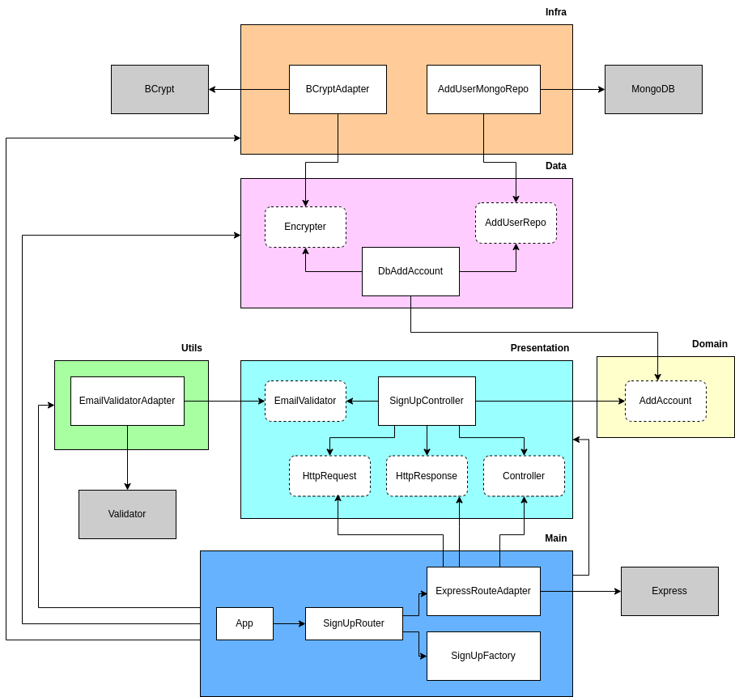

[](https://eslint.org/)
[](http://standardjs.com)
[](https://www.typescriptlang.org/)
[](https://github.com/okonet/lint-staged)
[](https://jestjs.io/pt-BR/)
[](https://github.com/kulshekhar/ts-jest)
[](https://github.com/typicode/husky)
[](https://www.npmjs.com/package/git-commit-msg-linter)
[](https://github.com/alangpierce/sucrase)
[](https://expressjs.com/)
[](https://www.mongodb.com/pt-br)
[](https://github.com/validatorjs/validator.js)


<div align='center'>

# Clean Node API

**_Essa API faz parte do curso do professor Rodrigo Manguinho (Mango) na Udemy._**

O objetivo do curso é mostrar como criar uma API com uma arquitetura bem definida e desacoplada, utilizando _TDD_ (programação orientada a testes) como metodologia de trabalho, _Clean Architecture_ para fazer a distribuição de responsabilidades em camadas, sempre seguindo os princípios do _SOLID_ e, sempre que possível, aplicando _Design Patterns_ para resolver alguns problemas comuns.

</div>


## Navegação

- [Requisitos](#requisitos)
- [Como Rodar](#como-rodar)
- [Princípios utilizados](#princípios-utilizados)
- [Design Patterns](#design-patterns)
- [Metodologias e Design](#metodologias-e-designs)
- [Funcionaliadades](#funcionalidades)
  - [Cadastro](#1cadastro)
    - [Casos de sucesso](#casos-de-sucesso)
    - [Exceções](#exceções)
    - [Arquitetura](#arquitetura)
  - [Login](#2login)
    - [Casos de sucesso](#casos-de-sucesso)
    - [Exceções](#exceções)

## Requisitos

Para rodar a aplicação, você precisará ter instalado na sua máquina:

- [Node](https://www.npmjs.com/)
- [NPM](https://www.npmjs.com/)

## Como Rodar

Instale as dependências:

```
$ npm i
```

Execute a aplicação:

```
$ npm start
```


## Princípios Utilizados

- Single Responsibility Principle (SRP)
- Open Closed Principle (OCP)
- Liskov Substitution Principle (LSP)
- Interface Segregation Principle (ISP)
- Dependency Inversion Principle (DIP)
- Separation of Concerns (SOC)
- Don't Repeat Yourself (DRY)
- You Aren't Gonna Need It (YAGNI)
- Keep It Simple, Silly (KISS)
- Composition Over Inheritance
- Small Commits

## Design Patterns

* Factory
* Adapter
* Composite
* Decorator
* Dependency Injection
* Composition Root


## Metodologias e Designs

* TDD
* Clean Architecture
* DDD
* Conventional Commits
* GitFlow
* Modular Design
* Dependency Diagrams
* Use Cases

## Funcionalidades

### **1.Cadastro**

### *Casos de sucesso*

1. [x] Recebe uma requisição do tipo **POST** na rota **/api/signup**
2. [x] Valida dados obrigatórios **name**, **email**, **password** e **passwordConfirmation**
3. [x] Valida que **password** e **passwordConfirmation** são iguais
4. [x] Valida que o campo **email** é um e-mail válido
5. [x] **Valida** se já existe um usuário com o email fornecido
6. [x] Gera uma senha **criptografada** (essa senha não pode ser descriptografada)
7. [x] **Cria** uma conta para o usuário com os dados informados, **substituindo** a senha pela senha criptorafada
8. [x] Gera um **token** de acesso a partir do ID do usuário
9. [x] **Atualiza** os dados do usuário com o token de acesso gerado
10. [x] Retorna **200** com o token de acesso e o nome do usuário

### *Exceções*

1. [x] Retorna erro **404** se a API não existir
2. [x] Retorna erro **400** se name, email, password ou passwordConfirmation não forem fornecidos pelo usuário
3. [x] Retorna erro **400** se password e passwordConfirmation não forem iguais
4. [x] Retorna erro **400** se o campo email for um e-mail inválido
5. [x] Retorna erro 403 se o email fornecido já estiver em uso
6. [x] Retorna erro **500** se der erro ao tentar gerar uma senha criptografada
7. [x] Retorna erro **500** se der erro ao tentar criar a conta do usuário
8. [x] Retorna erro **500** se der erro ao tentar gerar o token de acesso
9. [x] Retorna erro **500** se der erro ao tentar atualizar o usuário com o token de acesso gerado

### *Arquitetura*

<div align='center'>

</div>

### **2.Login**

### *Casos de sucesso*

1. [x] Recebe uma requisição do tipo **POST** na rota **/api/login**
2. [x] Valida dados obrigatórios **email** e **password**
3. [x] Valida que o campo **email** é um e-mail válido
4. [x] **Busca** o usuário com o email e senha fornecidos
5. [x] Gera um **token** de acesso a partir do ID do usuário
6. [x] **Atualiza** os dados do usuário com o token de acesso gerado
7. [x] Retorna **200** com o token de acesso e o nome do usuário

### *Exceções*

1. [x] Retorna erro **404** se a API não existir
2. [x] Retorna erro **400** se name, email, password ou passwordConfirmation não forem fornecidos pelo usuário
3. [x] Retorna erro **400** se password e passwordConfirmation não forem iguais
4. [x] Retorna erro **400** se o campo email for um e-mail inválido
5. [x] Retorna erro **500** se der erro ao tentar gerar uma senha criptografada
6. [x] Retorna erro **500** se der erro ao tentar criar a conta do usuário